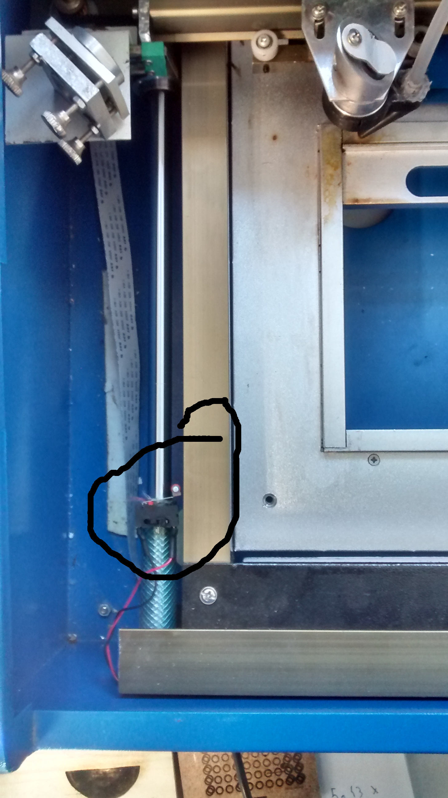
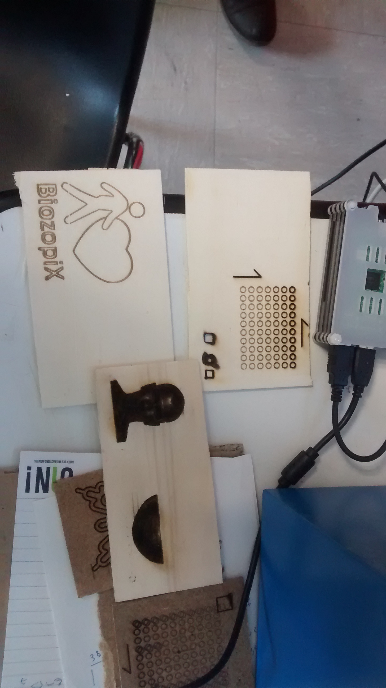
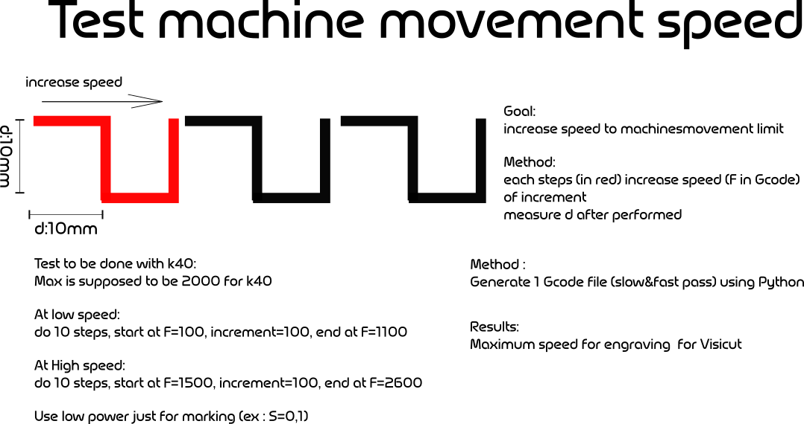
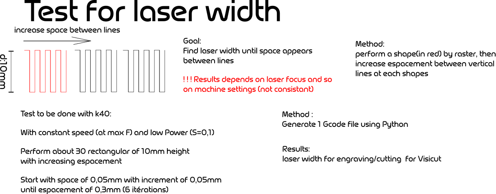

.. _laser_bocal:

Remise à neuf de la K40 à Chemillé
##################################

Depuis Juin 2018, une collaboration épisodique s'est mis en place entre l'Infini Fab et le Boc@l de Chemillé.
Ce dernier possède une découpeuse laser de type K40 non utilisée et avec des travaux d'améliorations non-terminés.

L'objectif de l'Infini Fab est de terminer ces travaux d'amméliorations, vous trouverez ci-dessous toutes les étapes effectuées jusqu'à présent ainsi que celles prévues.

La K40 est une découpeuse laser populaire chez les bidouilleurs car elle n'est pas chère et peut s’améliorer sans trop de frais.

.. contents:: Sommaire

La situation avant le début des travaux:
""""""""""""""""""""""""""""""""""""""""

Le boc@l a déjà changé la carte de commande de base de la K40 pour la remplacer par une smoothieboard
Au départ le laser de la K40 fonctionne mais la smoothieboard ne semble pas commander les moteurs
Le boc@l a entrepris ses travaux d'amélioration en même temps qu'un autre fablabs
Pronterface est le logiciel utilisé pour communiquer avec la smoothieboard.

Travaux effectués
"""""""""""""""""

Pour la rennovation
-------------------

* |cercle_vert| Installer un raspberry pi connecté à la smoothieboard pour mettre en place un serveur Octoprint  `Mise en place d'un serveur Octoprint`_
* |cercle_vert| Installer un capteur de température pour le circuit de refroidissement du laser. `Le capteur de temperature`_
* |cercle_vert| Installer un nouveau lit pour exploiter toute la surface de la laser et changer le focus `Le nouveau lit`_
* |cercle_rouge| Changer la tête du laser pour ajuster le focus du laser `La tête du laser`_
* |cercle_vert| Remmetre ou réparer le capteur de fin de course en Y `Capteur de fin de course en Y`_
* |cercle_vert| Mettre une sécurité sur le capôt de la laser `Securité du capôt`_
* |cercle_rouge| Usiner le capot de la partie commande de la laser pour y integrer le thermometre `Modification du capot de commande`_
* |cercle_rouge| mettre un guide pour l'arrivée d'air & installer laser visible, reparer la vitre du capot `Aménagement de la partie usinage`_
* |cercle_rouge| Ajouter un PiTFT au raspberry Pi pour demarer un job en étant devant la Laser `Ecran de commande la laser`_
* |cercle_rouge| Déclencher le compresseur uniquement quand on tire du laser `Declenchement du compresseur commandé par le laser`_
* |cercle_rouge| Regler l'alimentation du thermometre `Alimentation thermometre`_
* |cercle_rouge| Empecher le laser de tirer si la smoothie n'est pas alimentée `Prevention du laser`_

Pour la callibration
--------------------

* |cercle_vert| Callibrer les pas des moteurs pour avoir un déplacement précis `Calibration des Moteurs`_
* |cercle_jaune| Ajuster les mirroirs `Calibration des mirroirs`_
* |cercle_rouge| Fixer la smoothieboard, le level shifter, l'arduino et le raspberry pi dans la partie commande de la k40 `Aménagement de la partie commande`_
* |cercle_jaune| Ecrire un manuel d'utilisation pour la Laser `Manuel utilisateur`_

.. |cercle_rouge| image:: _static/red.png
  :height: 10px

.. |cercle_jaune| image:: _static/yellow.png
  :height: 10px

.. |cercle_vert| image:: _static/geen.png
  :height: 10px

La situation Actuelle
"""""""""""""""""""""

Aujourd'hui la K40 est situé dans le local de l'association Science&Bidouille à Angers, et est à disposition d'un nombre limité d'utilisateur pour l'instant.
La K40 Permet aujourd'hui de faire uniquement de la gravure, il faut regler les mirroirs et les nettoyer pour gagner en puissance.

:download:`Le fichier de configuration actuel <_static/config>`

Ce qui a été effectué au Boc@l
""""""""""""""""""""""""""""""

+--------------------------------------+------------------------------------------------+-------------------------------+
|Les problemes                         | Cause possible                                 |  Action Corrective            |
+======================================+================================================+===============================+
|Moteurs OFF                           |branchement de l'alimentation                   | mise au bon endroit du + et - |
|                                      |moteur inversée sur la smoothieboard            |                               |
+--------------------------------------+------------------------------------------------+-------------------------------+
|Commandement des moteurs X&Y ne       |mauvais branchement de la commande de moteurs   |Moteur X branché sur M1        |
|correspond pas sur Pronterface        |sur la smoothieboard                            |Moteur Y branché sur M2        |
+--------------------------------------+------------------------------------------------+-------------------------------+
|Direction du moteur Y inversée        |moteur inversée sur la smoothieboard            |Changement du parametre de     |
|                                      |                                                |configuration de la smoothie   |
|                                      |                                                |board                          |
+--------------------------------------+------------------------------------------------+-------------------------------+
|Mauvais "homing" sur l'axe X          |l'interupteur fonctionne (testé avec la commande|changement des parametres      |
|                                      |M119 sur Pronterface)                           |moteurs :                      |
|                                      |message d'erreur lors du homing en "X" :        |alpha_steps_per_mm        80   |
|                                      |ERROR: Homing cycle failed - check the          |beta_steps_per_mm         80   |
|                                      |max_travel settings                             |par                            |
|                                      |                                                |200 pour les 2 valeurs         |
+--------------------------------------+------------------------------------------------+-------------------------------+
|Masse du boitier non connecté à la    |Machine suivant les normes chinoises            |raccord de la masse au boitier |
|masse du réseau electrique            |                                                |de la K40                      |
+--------------------------------------+------------------------------------------------+-------------------------------+
|Non commande du laser par la          |La smoothie envoi un signal logique entre 0 et  |production & intégration d'un  |
|smoothieboard                         |3.3V pour commander le laser, l'alimentation de |level-shifter permettant de    |
|                                      |la laser attends des ordres entre 0 et 5V.      |commander l'entrée en 0-5V avec|
|                                      |                                                |une sortie 0-3.3V              |
+--------------------------------------+------------------------------------------------+-------------------------------+

Les ameliorations
"""""""""""""""""

Pour la rénovation
==================

Mise en place d'un serveur Octoprint
------------------------------------

|cercle_vert|
Octoprint est un serveur dédié installé sur un Raspberry Pi qui permete de commander un machine numérique qui fonctionne en G-Code(imprimante 3D, découpeuse laser).
Ce type de serveur permet la préparation d'un job d'un manière classique(jusqqu'à obtention du gcode) sur un PC, puis d'envoyer le gcode sur Octoprint.
Cela permet de garder un suivi des job qui sont exécuter sur la machine.

`Methode utilisée pour configurer l'Octoprint pour le Smoothieboard <https://github.com/foosel/OctoPrint/wiki/Setup-OctoPrint-with-Smoothie>`_

Le capteur de temperature
-------------------------

|cercle_vert|
Le tube laser est sensible au hausse de température, pour éviter une surchauffe nous allons intaller une capteur de température au niveau du liquide de refroidissement.

**Materiel**:
* Sonde temperature DS18B20

.. image :: _static/ds18b20.jpg
  :height: 100px

* Arduino nano
* Afficheur 7 segments
* 7 Resistance 220 Ohm
* 1 Resistance 10 kOhm

`Mesurer la température <https://www.carnetdumaker.net/articles/mesurer-une-temperature-avec-un-capteur-1-wire-ds18b20-et-une-carte-arduino-genuino/>`_

`page où le code pour afficher la température à été récuperer <https://randomnerdtutorials.com/arduino-temperature-displayed-on-4-digit-7-segment/>`_

:download:`le code final <_static/k40_temp_measurement.ino>`

.. Note::
  Dans le code, on appelle la fonction température 1 fois toute les 1000 itérations de la loop pour avoir un affichage qui ne clignote pas

Le nouveau lit
--------------

|cercle_vert|
La surface de travail de base de la K40 est assez réduite, alors qu'elle peut etre facilement doublée.
Il faudrait changer le type de lit, une surface métalique pleine telle que celle de base induit une réflexion du laser et donc sur le dessous du materiel à couper.
L'idéal serait un lit en nid d'abeille

.. image :: _static/honeycombe.jpg

Mais un grillage, une plaque trouée devrait suffire.
On a pu récuperer des grillages qui étant le devant de chauffage électrique. On a suffisamment de surface pour doubler la couche de grillage pour le lit, cela pourrait augmenter la rigidité de celui-ci.

On a finalement utilisé qu'une seule couche de grillage, on a fabriqué une structure qui est ajustable en hauteur en suivant le lien suivant :

|Structure lit|

.. |Structure lit| raw:: html

   <a href="https://www.thingiverse.com/thing:1906231" target="_blank">Lien thingiverse explicant tout</a>

**Configuration du nouveau lit dans les parametres de la Smoothie**

* On a inversé le sens de l'axe des Y, c'est peut etre pas une bonne idée vu que les gravures apparaisse en mirroir, ce qui est genant pour les écritures, à revoir |cercle_jaune|
* La nouvelle taille du lit est maintenant de 326mm suivant l'axe des x et de 207mm suivant l'axe Y

La tête du laser
----------------

|cercle_jaune|
Le focus du laser est très important pour exploiter au maximum la puissance du laser. Ce focus se reggle en modifiant la hauteur entre le materiaux et la tête du laser.
Plutôt que d'opter pour une solution où c'est le lit du laser qui doit changer de hauteur nous allons chosir de changer la tête de base de la k40 pour une tête qui peut bouger en hauteur.

Comme celle-ci :

.. image :: _static/tetelaser.webp
  :target: https://fr.aliexpress.com/iteCapteur de fn de course en Ym/Cloudray-CO2-Laser-Head-Set-pour-2030-4060-K40-De-Gravure-Laser-Machine-De-D-coupe/32836741034.html
  :height: 100px

On a bien reçu a pièce, mais je me suis trompé dans le reference, la lentille actuelle de la k40 fait 18mm de diamètre, la pièce commandée est faite pour une lentille de 12mm.
De plus sur la pièce commandée je ne vois pas comment la fixer sur le rail des X.
Vu le temps pour recevoir la pièce (2mois) on va partir sur une solution imprimée 3D, avec la pièce suivante :

`Fichiers utilisés pour la nouvelle tête <https://www.thingiverse.com/thing:3512646>`_
Merci à Pascal qui a imprimer gracieusement les pièces, mais c'est solution n'était pas assez fiable pour une utilisation sereine.

Finalement, faute de temps et de budget on va ajuster le focus via le lit que l'on peut ajuster en hauteur.
`Le nouveau lit`_

Capteur de fin de course en Y
-----------------------------

|cercle_vert|
Le type de capteur utilisé sur la k40 de base

.. image :: _static/fin_de_course-origin.jpeg
  :target: https://www.vishay.com/docs/83763/tcst1030.pdf
  :height: 100px

à priori il fonctionne mais le cablâge n'est plus bon, il faut verifier que le capteur est correctment allimenté(trouver le 5V).
Après plusieurs essais, on abandone l'utilisation du capteur d'origine.
La solution est alors d'utiliser un capteur méchanique simple.

.. image:: http://forain-francois-verdier.ecollege.haute-garonne.fr/lectureFichiergw.do?ID_FICHIER=1450339321811
  :height: 100px

On a installer le capteur en bas du guide de l'axe Y à gauche.

  Interrupteur end_stop sur la laser k40

Dans les fichiers de config de la smoothie, la valeur de Y augmente du haut vers le bas.
Dans le fichier de config de la smoothie on a donc un home to max sur l'axe beta.

`page explicant les parametre de smoothie sur les endstop <http://smoothieware.org/endstops>`_

Soufflage au niveau du foyer
----------------------------

|cercle_vert|

Le laser vaporise le materiel qu'il grave ou découpe, c'est par la suite que celui ci prend feu. Pour éviter des flammes au niveau du foyer et avoir un travail plus propre on a installé un système de soufflerie qui ammène un flux jusqu'au foyer.

Au niveau de la tête du laser, on a monté `l'embout suivant imprimé en 3D <https://www.thingiverse.com/thing:2421971>`_

Pour pouvoir souffler les particules vaporisées par le laser afin d'éviter qu'elle prennent feu, on dispose d'un souffleur. il a fallu réaliser un un embout imprimmé en 3D.

 :download:`Le fichier STL de l'embout <_static/embout_soufleur_2.stl>`

Securité du capôt
-----------------

|cercle_vert|
Pour éviter que le laser ne tire avec le capôt ouvert, on a installé un capteur de fin de course, on a suivi l'exemple de la video suivante.

`la video d'installation du capteur de fin de course <https://www.youtube.com/watch?v=VZTmWC3sXR0>`_

Modification du capot de commande
---------------------------------

|cercle_rouge|

Il faudrait faire un trou pour y fixer l'afficheur de température

Aménagement de la partie commande
---------------------------------

|cercle_rouge|

Il faut :

* Fixer la smoothie, celle-ci possède déjà un boitier imprimmé en 3D qui devrait faire l'affaire
* Fixer le level shifter, il faut d'abord imprimer en 3D un support qui devrait être fixer dans la k40
* Fixer le boitier d'alimentation des moteurs

Aménagement de la partie usinage
--------------------------------

|cercle_rouge|

* Mettre un guide pour l'arrivée d'air
* Installer un laser visible au niveau de la tête du laser pour montrer où celui-ci tire
* Rendre un peu plus propre la vitre du capôt

Ecran de commande la laser
--------------------------

|cercle_rouge|
On pourrait utilier un écran PiTFT pour pouvoir lancer des jobs en étant devant la laser.

`un possible moyen de le faire <http://projectable.me/raspberry-pi-touchscreen-octoprint-controller/>`_

Declenchement du compresseur commandé par le laser
--------------------------------------------------

|cercle_rouge|
On peut utiliser la sortie de la smoothieboard "laser_module_ttl_pin" à récuperer sur l'Arduino Nano utilisé pour le capteur de température qui commanderais alors le comprésseur

Alimentation thermometre
------------------------

|cercle_rouge|
L'arduino qui commande le laser est alimenté via la prise USB qui est actuellement branchée sur le raspberry pi avec Octoprint.
Le probleme actuellement est que Octoprint doit detecter automatiquement la smoothie board au démarage, hors si l'Arduino nano est branché sur le raspberry au démarage d'Octoprint, celui-ci est perdu et ne detecte plus la smoothie board.

2 solutions possibles (peut-etre d'autre):
* trouver un moyen pour octoprint de ne pas confondre la smoothieboard et l'arduino nano (la plus propre)
* Récuperer une tension d'alimentation pour l'Arduino nano, via la smoothie ou directement via une prise 220V

Prevention du laser
-------------------

|cercle_rouge|
Si l'on alume la K40, que l'on enclenche le laser sans avoir brancher la smoothieboard sur une prise USB, le laser tire.
Cela peut etre prevenu en s'assurant que la smoothie soit alimentée via USB avant d'enclencherle laser, Néanmoins c'est perturbant de ne pas avoir la smoothie qui démarre quand on allume la K40.

Si la smoothie est branchée en permanence sur le Rasperry, lors pas de soucis.
Sinon trouver un moyen de démarer la smoothie quand on allume la K40

Pour la calibration
===================

Calibration des Moteurs
-----------------------

|cercle_vert|
`simplement suivre ce tuto <http://smoothieware.org/laser-cutter-guide#configuring>`_

Pour regler les parametres correctement, on commande un déplacement de 100mm, on mesure le déplacement obtenu puis on fait un produit en croix pour obtenir le nouveau parametre de "step per mm" pour l'axe voulu

:math:`nouveau..step..per..mm=\frac{ancien..step..per..mm * deplacement..désiré}{deplacement..mesuré}`

Modulation de la puissance du laser
-----------------------------------

|cercle_jaune|
La smoothie permet de controller la puissance du laser en puissance en modifiant `la proportion du temps où le laser est allumé <https://fr.wikipedia.org/wiki/Modulation_de_largeur_d%27impulsion>`_

On active le parametre "laser_module_pwm_period " et on le met à 200

  grille de callibrage utiilisée pour tester le modulage de la puissance du laser

On constate qu'on a bien une modulation du laser, mais peut-etre il est possible d'affiner cette modulation afin d'avoir une modulation mieux répartie entre "pas de laser du tout" c.à.d. S=0 et "laser au max" c.à.d. S=1

La method utilisée

.. figure:: _static/lasermodul.png
  :height: 300px

:download:`Le code python utilisé pour générer le Gcode utilisé <_static/LaserModulation.py>`

:download:`le Gcode généré <_static/laserModulation.gcode>`

Calibration des mirroirs
------------------------

|cercle_rouge|
`un très bon guide pour aligner les mirroirs <https://k40laser.se/lens-mirrors/mirror-alignment-the-ultimate-guide/>`_

Pour la calibration, mettre du scotch au niveau des mirroir est fonctionnel mais pas très pratique, la colle du scotch brule et se colle au mirroir.
On peut utiliser des support pour mettre des cibles devant les mirroir qui ne les salirons pas en brulant.

`Possible outil à imprimmer pour l'alignement <https://www.thingiverse.com/thing:1584548>`_

Tester la vitesse maximum de déplacement
----------------------------------------

On peut commander les moteurs de la k40 avec une vitesse de 10000mm/min ce qui est beaucoup trop pour les moteurs de la laser. En envoyant des consignes de vitesses trop élevée on obtient aucun déplacement.
En théorie, la vitesse maximum d'une k40 avec les moteurs de base est de 2000mm/min. Il convient néanmoins d'effectuer des tests afin de vérifier la constance des déplacements des moteurs en fonction de la consigne de vitesse.

Il a fallut mettre en point la méthode suivante

:download:`Le code python utilisé pour générer le Gcode utilisé <_static/Max_speed_callibration.py>`

:download:`le Gcode généré <_static/maxSpeedCal.gcode>`

Tester l'épaisseur du laser
---------------------------

Lors d'un parametrage d'une gravure ou d'une découpe sur Visicut, on a le paramêtre de l'épaisseur du laser.
Pour avoir une découpe précise, on a mis au point la méthode suivante pour déterminer l'epaisseur du laser.

:download:`Le code python utilisé pour générer le Gcode utilisé <_static/Laser_width.py>`

:download:`le Gcode généré <_static/laserWidth.gcode>`

Manuel utilisateur
------------------

|cercle_jaune|
:ref:`Manuel d'utilisation de la k40 <manuel-k40>`

La méthode à utiliser pour usiner un job sera surrement via le logiciel Visicut, qui permet de génerer du G-code pour du raster ou de la coupe à partir d'un fichier d'image vectorielle ou d'une image pixelisée
