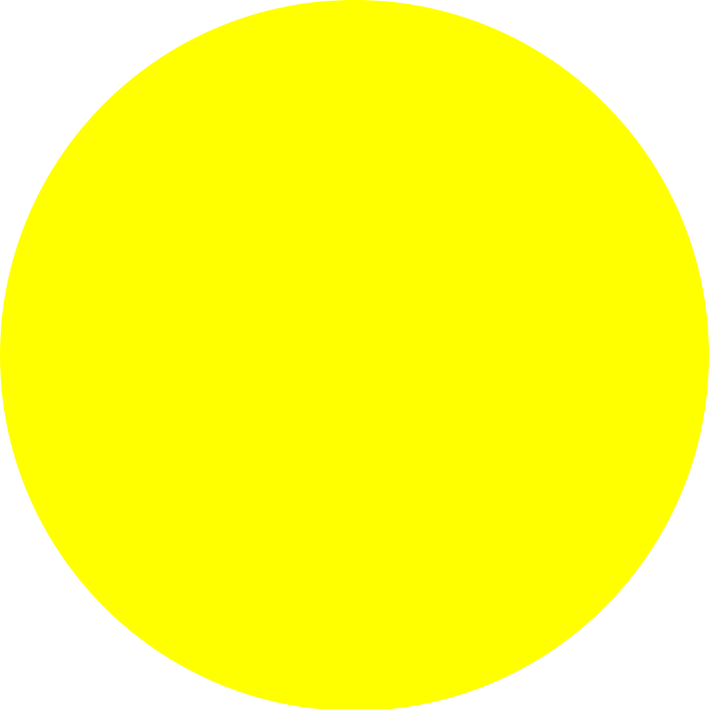

.. _laser_bocal:

Remise à neuf de la K40 à Chemillé
##################################

Depuis Juin 2018, une collaboration épisodique s'est mis en place entre l'Infini Fab et le Boc@l de Chemillé.
Ce dernier possède une découpeuse laser de type K40 non utilisée et avec des travaux d'améliorations non-terminés.

L'objectif de l'Infini Fab est de terminer ces travaux d'amméliorations, vous trouverez ci-dessous toutes les étapes effectuées jusqu'à présent ainsi que celles prévues.

La K40 est une découpeuse laser populaire chez les bidouilleurs car elle n'est pas chère et peut s’améliorer sans trop de frais.

.. contents:: Sommaire

La situation avant le début des travaux:
""""""""""""""""""""""""""""""""""""""""

Le boc@l a déjà changé la carte de commande de base de la K40 pour la remplacer par une smoothieboard
Au départ le laser de la K40 fonctionne mais la smoothieboard ne semble pas commander les moteurs
Le boc@l a entrepris ses travaux d'amélioration en même temps qu'un autre fablabs
Pronterface est le logiciel utilisé pour communiquer avec la smoothieboard.

Reste à faire
"""""""""""""

* |cercle_jaune| Installer un nouveau lit pour exploiter toute la surface de la laser `Le nouveau lit`_
* |cercle_jaune| Changer la tête du laser pour ajuster le focus du laser `La tête du laser`_
* |cercle_vert| Remmetre ou réparer le capteur de fin de course en Y `Capteur de fn de course en Y`_
* |cercle_vert| Mettre une sécurité sur le capôt de la laser `Securité du capôt`_
* |cercle_vert| Callibrer les pas des moteurs pour avoir un déplacement précis `Calibration des Moteurs`_
* |cercle_rouge| Ajuster les mirroirs `Calibration des mirroirs`_
* |cercle_rouge| Usiner le capot de la partie commande de la laser pour y integrer le thermometre `Modification du capot de commande`_
* |cercle_rouge| Fixer la smoothieboard, le level shifter, l'arduino et le raspberry pi dans la partie commande de la k40 `Ammenagement de la partie commande`_
* |cercle_rouge| mettre un guide pour l'arrivée d'air & installer laser visible, reparer la vitre du capot `Ammenager de la partie usinage`_
* |cercle_rouge| Ajouter un PiTFT au raspberry Pi pour demarer un job en étant devant la Laser `Ecran de commande la laser`_
* |cercle_jaune| Ecrire un manuel d'utilisation pour la Laser `Manuel utilisateur`_
* |cercle_rouge| Déclencher le compresseur uniquement quand on tire du laser `Declenchement du compresseur commandé par le laser`_
* |cercle_rouge| Regler l'alimentation du thermometre `Alimentation thermometre`_
* |cercle_rouge| Empecher le laser de tirer si la smoothie n'est pas alimentée `Prevention du laser`_

.. |cercle_rouge| image:: img/red.png
  :height: 10px

.. |cercle_vert| image:: img/geen.png
  :height: 10px

La situation Actuelle
"""""""""""""""""""""

Aujourd'hui la K40 est situé dans le local de l'association Science&Bidouille à Angers, et est à disposition d'un nombre limité d'utilisateur pour l'instant.
La K40 Permet aujourd'hui de faire uniquement de la gravure, il faut regler les mirroirs et les nettoyer pour gagner en puissance.

:download:`Le fichier de configuration actuel <_static/config>`

Les réparations
"""""""""""""""

+--------------------------------------+------------------------------------------------+-------------------------------+
|Les problemes                         | Cause possible                                 |  Action Corrective            |
+======================================+================================================+===============================+
|Moteurs OFF                           |branchement de l'alimentation                   | mise au bon endroit du + et - |
|                                      |moteur inversée sur la smoothieboard            |                               |
+--------------------------------------+------------------------------------------------+-------------------------------+
|Commandement des moteurs X&Y ne       |mauvais branchement de la commande de moteurs   |Moteur X branché sur M1        |
|correspond pas sur Pronterface        |sur la smoothieboard                            |Moteur Y branché sur M2        |
+--------------------------------------+------------------------------------------------+-------------------------------+
|Direction du moteur Y inversée        |moteur inversée sur la smoothieboard            |Changement du parametre de     |
|                                      |                                                |configuration de la smoothie   |
|                                      |                                                |board                          |
+--------------------------------------+------------------------------------------------+-------------------------------+
|Mauvais "homing" sur l'axe X          |l'interupteur fonctionne (testé avec la commande|changement des parametres      |
|                                      |M119 sur Pronterface)                           |moteurs :                      |
|                                      |message d'erreur lors du homing en "X" :        |alpha_steps_per_mm        80   |
|                                      |ERROR: Homing cycle failed - check the          |beta_steps_per_mm         80   |
|                                      |max_travel settings                             |par                            |
|                                      |                                                |200 pour les 2 valeurs         |
+--------------------------------------+------------------------------------------------+-------------------------------+
|Masse du boitier non connecté à la    |Machine suivant les normes chinoises            |raccord de la masse au boitier |
|masse du réseau electrique            |                                                |de la K40                      |
+--------------------------------------+------------------------------------------------+-------------------------------+
|Non commande du laser par la          |La smoothie envoi un signal logique entre 0 et  |production & intégration d'un  |
|smoothieboard                         |3.3V pour commander le laser, l'alimentation de |level-shifter permettant de    |
|                                      |la laser attends des ordres entre 0 et 5V.      |commander l'entrée en 0-5V avec|
|                                      |                                                |une sortie 0-3.3V              |
+--------------------------------------+------------------------------------------------+-------------------------------+

Les ameliorations
"""""""""""""""""

Mise en place d'un serveur Octoprint
------------------------------------

|cercle_vert|
Octoprint est un serveur dédié installé sur un Raspberry Pi qui permete de commander un machine numérique qui fonctionne en G-Code(imprimante 3D, découpeuse laser).
Ce type de serveur permet la préparation d'un job d'un manière classique(jusqqu'à obtention du gcode) sur un PC, puis d'envoyer le gcode sur Octoprint.
Cela permet de garder /path/to/fileun suivi des job qui sont exécuter sur la machine.

`Methode utilisée pour configurer l'Octoprint pour le Smoothieboard <https://github.com/foosel/OctoPrint/wiki/Setup-OctoPrint-with-Smoothie>`_

Le capteur de temperature
-------------------------

|cercle_vert|
Le tube laser est sensible au hausse de température, pour éviter une surchauffe nous allons intaller une capteur de température au niveau du liquide de refroidissement.

**Materiel**:
* Sonde temperature DS18B20

.. image :: img/ds18b20.jpg
  :height: 100px

* Arduino nano
* Afficheur 7 segments
* 7 Resistance 220 Ohm
* 1 Resistance 10 kOhm

`Mesurer la température <https://www.carnetdumaker.net/articles/mesurer-une-temperature-avec-un-capteur-1-wire-ds18b20-et-une-carte-arduino-genuino/>`_

`page où le code pour afficher la température à été récuperer <https://randomnerdtutorials.com/arduino-temperature-displayed-on-4-digit-7-segment/>`_

:download:`le code final <code/k40_temp_measurement.ino>`

.. Note::
  Dans le code, on appelle la fonction température 1 fois toute les 1000 itérations de la loop pour avoir un affichage qui ne clignote pas

Le nouveau lit
--------------

|cercle_jaune|
La surface de travail de base de la K40 est assez réduite, alors qu'elle peut etre facilement doublée.
Il faudrait changer le type de lit, une surface métalique pleine telle que celle de base induit une réflexion du laser et donc sur le dessous du materiel à couper.
L'idéal serait un lit en nid d'abeille

.. image :: img/honeycombe.jpg

Mais un grillage, une plaque trouée devrait suffire.
On a pu récuperer des grillages qui étant le devant de chauffage électrique. On a suffisement de surface pour doubler la couche de grillage pour le lit, cela pourrait augmenter la rigidité de celui-ci.
On n''install pas de nouveau lit avant d'avoir installer une nouvelle tête.

La tête du laser
----------------

|cercle_rouge|
Le focus du laser est très important pour exploiter au maximum la puissance du laser. Ce focus se reggle en modifiant la hauteur entre le materiaux et la tête du laser.
Plutôt que d'opter pour une solution où c'est le lit du laser qui doit changer de hauteur nous allons chosir de changer la tête de base de la k40 pour une tête qui peut bouger en hauteur.

Comme celle-ci :

.. image :: https://ae01.alicdn.com/kf/HTB1FNLDc3fH8KJjy1zcq6ATzpXal/Cloudray-CO2-Laser-Head-Set-pour-2030-4060-K40-De-Gravure-Laser-Machine-De-D-coupe.jpg_640x640.jpg
  :target: https://fr.aliexpress.com/iteCapteur de fn de course en Ym/Cloudray-CO2-Laser-Head-Set-pour-2030-4060-K40-De-Gravure-Laser-Machine-De-D-coupe/32836741034.html
  :height: 100px

Capteur de fn de course en Y
----------------------------

|cercle_vert|
Le type de capteur utilisé sur la k40 de base

.. image :: data:image/jpeg;base64,/9j/4AAQSkZJRgABAQAAAQABAAD/2wCEAAkGBxITEBUSEhIWFhUVFRYVGBcVFhgXFxUWGhUYFhUVFxUYHSggGBolHRcXITEhJSorLi4uGB8zODMsNygtLisBCgoKDg0OFRAQFy0ZFR0rLSstKzcrNy0rKy0tLS0tNy03LS0tKy0rLSsrLS0tKystLTQrKy0rKy0rLis4LTU1K//AABEIAOEA4QMBIgACEQEDEQH/xAAcAAEAAQUBAQAAAAAAAAAAAAAABgECBAUHAwj/xAA+EAACAQIEAwUGBAQFBAMAAAABAgADEQQSITEFQVEGBxMiYTJxgZGhsRQjwfAzQlLRJGKCkvFyorLhFkNz/8QAGAEBAQEBAQAAAAAAAAAAAAAAAAECAwT/xAAhEQEBAQEAAQMFAQAAAAAAAAAAAQIRAxIhQSIxUWFxE//aAAwDAQACEQMRAD8A7jERAREQEREBEShgViUvF4FYmLxHHJRpPWqGyU1LMfQAk/aRXgvebw+ucpqeE1zfxPIoAawOdrA3Fj8YE0ieNDEo6h0ZWU/zAgj5iVauB6noNT8oHrEsD8/vpL4CIiAiIgIiICIiAiIgIiICIiAiIgIiICIiAlDKy1oFiVL30MqpNtRrPMAioehF/lYSr1MqlidACfgNdoHOu+XirLhfw1M3aqbt6KCLg87EEicRxFeyhLg2BBsAdb3AuddpIe1XHHxWPxNXXKDUVDsCtNn8H2uo/YkfVVrAs/lYKbkEWJBsLg3J06QMvg/anGYU3o4l1F75SFdfcRUVgNuU6d2V73DUv+Lo+wFGelY5s1wSQctrZRt1nF6aqVYk6ra3z1+hmTw3FBQ+bNlaw8pA3vvcesD6p4P2gw2Kv4FdHIFyFNyu2/zE20+P8LUYOChYEXK25fu87/3YdpnrU/AxDs9UXYM1tVy+zpuRYn4wOgxLKZvrL4CJQRArEpKwEREBERAREQEREBERAREQEREBERA8/D8178rWkD73uO/hcAURyKlchFOYhlAIZjbc3AYct50CfNHeh2g/F49ipvTpflp02LZtP+q0giWIxDMLE3GxB1vba95jgc/+PlKk39/OXTUVaD9ZV7f2iwvKoNZEZ/C6RLjcD00kl4fxU0sQppt56ZBurW65l02utxfoZp+HqFplzfSYeFZmqqNQWNyTYWFieXqLQPqbs7xdcVh1rKLZhYre+Vh7S3sL2Ol7CbOQTupwrrQqOSMjlQoBJsVzZjqOdxJ1AtzQG0kd49i6viJTpmrTABdqqpSajYAnw6hcllvbdVvqNZ64HF1qqUr2UvapnoWqUsgysFLVAG84O4XrqJJW/wDOzPW9vK5pBe2/b0YCvTpLTFQEFn11U6WFr8wbzI4D3lcPxWniGi5bKErZVdtAdAjN168pWOXiaRLKZl8BERAREQEREBERAREQEREBLTLpa0CLd43aI4HBNUQjxGORB/mIJH/jPmE2AAHLSdK75+0AxGMXD0yClAakNcM5AIOmgy3YTmZOvpCq259ZfllCLc7y4G8IrtPTCJc6C5Og+M8JtcBrY7Zdb/vpaBdxGoAi0xtufqD9TM3sjw81agNvaYKCAbi9r2+Bmlq+dz1OwvsBp9d/jOwd0vAz4gqlSFpCy6EgsVIIJ2uAwPylg6bwnh60KKUl2VQDb+ZreZvjLqvEKavkZrEqX1DBQoIUkvbKNSNCbz3r1FRS7sFVRmZmYBVUC7Ek6AAX1mDj6OHrZaVR1N/zPDzi1RdvMv8APT8w022ma1iT8I/g69J6jlKNSlXazYhlABpADMB4hBSsDly/llva+M3OErU6dGpjHy2ZPEzBGRjRUF6QdW1DhTqLDUnQbTFocPRAuFpu7C4d82IPi00GqEX8xQsmW2g1b1kX75+0go4YYWmy561y9mGZEFtGQa2cFgCeh3mcx18unI+1fGTicVVrNr4jf9oART8lWaXNqfXkJax+un1vPM3m3BJ+znbXG4QgUa90X/63F0PvtYn4GdK7O98tJrLjKZpnnUpqxpj/AEDM/wDxOJKv7O/zl1OrblpA+r+D8ew2JQVKFZXDbDVW2v7DANa3pNmk+UuDYh6eIp1KJKVVN8wJBtY3BtvcXB9DPpHsfx0YrDhyU8QWDhSDY9bDYGx0gb+Jbml0BERAREQEREBERATS9sOMDCYKviP5kpuU9amQmmPiwE237M49328TarUpYSlchPPVA2NyuUH3ZWkHJMZVLuzkm7szm+5zEm31+kxHGk966FTY9dAOU8TrKdWqNZcDY3lAZUCBdSW5982mIGSmo5t9tL/ea6mbHnMw4dnS9zYED/dpm9wtrJ1rOe649eAYbNVDdAT8Lgfe0+juwfCvw+DUG4NQ+IwPJiALf9onKO7bgq1cStMqCqjxKinmoIW5+LLO18K4nSxCl6RYqrFTmR0NwATo4BIsRrL1deO5vuyq9IMpVhcEEEdQRaaelwistx4+a4IVyqB6YvoigLYj39JuzNJx2iK7phjqjAvVVlJV6Q8rUydgSWU/AyVfHqy/p7cLQhGruGUveoVdVDUlyj8u68hYnc6kz547fcbOLx1WqbWDMietNXYUz8VtOx97vHhh8F4YJD1mC3W11AIYk+hCkT55rm51Fr3Pv9ffLGNXry3O8uAEtU8p6rtaEUJ9JSmolFX6fflM6mhIHUnKB6HU/UQM7gdP2n3N+fwk67I8eGCqeK+lJtHA+h195kaw2HtlQTd4Xs4+MZKKaeYEt/SoIuflA7pRqBkVhsVDAe8XH3nvMbB0siIn9KgfIWvMmAiIgIiICIiAiIgYPFMatGi9VyAqqTc6C/LX1NhPnjC8aqVq9fFOdHzNY3NlOYqLnpedA78OP5KC4JGs1XK7jT2A+Zdd/apzktXFBaOVTdmBBHS4t+sZpXucZTrkp4IDXvcWueW4EtxHBEOiOA39JsP1lvBECg1L2sLE9DcS7FmjUHiLUKueRJ+151YajGcPemxDDQAm/unitNjqBp1kowFF2oNfzMVIBPu5TBbhyIv5j2PQTNyvWoRf3eSThZXKLakbje46Ecx1E0PgXJy7StNSNrgjofpMWOmdzN67f3e4dKYSpTek71SVqISqVKSXPmG5YXVPJpowN9NdzisbiKWI/DpVVR5aoaot86EkPRDE6sqozluh20vOQdke1IoVj46GpSqIUqZTldUuvmQrlOa6gbjc6zq+B45g8VlTC4imzvTCU8NVYZl1Y1WNQA1Mxp5xa5HlG2pmLnjvPLLfq+1SZOLU2otW18NfEa/JkTUup5qRqDsRNd2e4nSGbxsVTNeqxYp4oOVdqYVCfIMmS9tzc85C+13EzhVenSL0wtOiljZlQoGFELnvmR9QxbWwG85Pica7Mz5iCx11sSeqkagemkZvweXExn+tx2+7RnFY2pUJvTUhaYBNgu9iOepOsibvc7Aam1hbnPVzcn11vKBddd5t5hacq9p7UwbGebpaBbRpc5tOE0buX6Cw+YuZhJ7OnPT48pIcBQAQD4/Dn9ZUbPhlG5v8Outp1zsDwoU6JqMPM+litiAL7HmDf6TnvZ/hzVKlNFXVjr8ASx+QM7PgqARFQXsqhRfnYWvIr1Ky6IgIiICIiAiJQQDTyq1QqlibAbknQes9HnPe+TtB4GCFBPbxByGxsVp5HzOPcwQfGBzHjHEkx+LrVqmazHKgGwUeYbg87zRcR4YFBZXB0tbnMvAkU6JbW5FhrbT9kzG4Vhc5LN7N7knbfW5m+M1gLUqBCgXy+4zEonzAN11PObapxfK1gq5QbWuCD63tpKY7BJUcNR1udgLge+0nV+HuOKBXRE9gWBPW9hMTj9P/ABDHk2Qj/YoipwdtSpBK8gekxKtV2tm1y6S1I3/Ca2SgxJ2Jt8QomLw3DeIxLGw1LfDUfrMZsQDTCKNrE/P/ANTNwHkubFkfQ23t9esdOMxeF0nou6M2YcjbXkOU0DHW1yNL3HUG4/SSjEvTp0iyMbMLC+mvu+BkRv6mKStjiMdUqgeI2bKoUX5AC36TBcTMwFJSbu1gNTpy6bzNx3D6bUjUom+XQ6envk4utdaBpVAN5UJfXlLWFtD6SDIJG8oy3ItzE8sukyEGVddLfroBA98EmZ7cksP38pIsGt212mr4bh7IL7nzHlvraSXguGzEC178gLnfpCuid3fDNDXYag5V9DbU/JpOlmJwnACjSWmCDbc2tmPW19JmASCsREBERAREQEREC1p8195PGzieIVH18Om3hqNNMoCvz/qUz6SrqSpAJFxuNx7vWcgHdMz45vFYnDnPUNQFczMWByEb38za5beWByirjCygchNnwWqGpvSuAWUgX2JIIE0mPo5apC9bC3I9P31m2xXBMRRw6V6ihVIDC5W7bEn2t9vnHqPT14LwWpmINh0OuX7S7DZqLAn2CdSOfzmE/EHYWLkg8iRNhhMUjU/DqaBZtKvxFEr/AIii11uSVJN7Xuesx8DjQarMaYs2w9dB+hmW1elSRlVr3FgNenu9Z4cFw+Zi39IJt8YSMvF4ajfVsjdOsw8Hi2S9j89ra3mNjsSXffeUUrcanTeQVxmLapoxuBtbr+zPGnpz5Tc47A0lpBgTrv8AEE9Jr8Nw6oy5lFgbDUqL6++Xh1dVwhQU3OoexsOgtf7zc8WcKgWkMoYC4+E1BxFWlemyggHS9ja3SxnlWxrswY6W2tL3g2XD+FgG9TQnW08+L0Q1YKgAsLH7TJwfFQ4ZqgAI2/fxmPh8QFrmpqQd7cgecvsz2vSlwSy3BBfpr/aa+jRDOqnYeZvrb6iSLC0QhfEZhly3AHpYX9+hmq4RQupJGrtf7f2mdNRs8LT1Gwvbf6Tofd1wUtX8Vh5UF78s9xZf9pJ+EhfD8MS23Sdt7NcOFDDqtrMRdiPp9LTLTcRESBERAREQEREBERAoZh8Vwj1KNSnTqGmzKQrgaqeoAI+8zYMD5q4b2YejxNKeMovlRruFViGBUikyEDzp4mW5Ghsw6zL73McXqpQQXpUiyjyEfmEgVVUcgCoAUbbTr3H8WVNWp5gtNFp/w6ZzVHfItmOosXU/Ccfxnnxnm864NGruDu+JTz1BfozU/wD0Jy77usiA4jA1EUuyNkDBfEsTTDkZlQvbKGtc2vfSedKuQR+un35z6f7D9nEw+DAqU0apWY1qlrupLEmnYONCEKroBsZFu1Hcthaik4JjRYKoFNmLUyQ1yzM2ZwbaadBOsrnXElrKf3+syqGIYAqp3HKenaXsvicC+XEU8t2dUYkZamQ2LJzINwdQNxNfgHAbzGXqMqkut5dSTMwUblh8r6zKxGHCi4mEtXzdPXpE0nG6xlVaj06SnQe175ZxLEk1Fppoq2sB1vvpNZhq+Vw/K/zmz/FUs3ifzb29+k3KzXrjghqqHttroLnaUOFpVUYKMrL6Xv8AaW4qlnUVl9oa+62szaKkpyU7/v7y8RHqHD3YaA/3nrha7UmKutwdCvrsD95n4iufFCKLWMpxoDxRfSwufWSxp54jEF8tFBlB1Nj9PdrN1hqXTlNRwfD3LVDrfQfb9JI8HRvt0v8ApMNJT2G4T4uJUn2aYVjpp1W/vymdYA+0j3YjhYo4cMfaqhT/AKbEp9GMkRkF0REBERAREQEREBERAo0xcbXyIzaGw0FwCT7zpMoyP8cr03rJRdlC0/z6mexXKvkym+guainXpM6qyIZ2xxi4fDZGAJoLnq9Kj1PyVHqykq2nQSOdguzjv+GDlStdhXqKRq60mR1uL6XDm0t7YVmxOMp4WwBdmxFUE2ystNi1JjystIEA8yNJPe7Hh6tTfFXDZ7UqWZbvSpUywVRUJvaxGmlrTnJ2t6qb01sABpbT4chPWWkS6dnN44uiro1NwGRwVZTsykWIPoQZzbtR3QYauxfDN4LMR5SAaQULlsqgAgkgHU7kzprSjGw15awPk3tBwfE4CqKFdMjsoqAXVroSyjVSeaNNOXzcrG5+A5SVdveNfj+JPVFyi2podf4aln+7tNBQwbVq/h0hmJbKthvrZdusDFp1SpsdRMqlUU+kmGP7p+IU6XiZEawuVRiz7bBALkyHcT4PXw5tWpPTJ2DqyXHXUe/5QMyjjHT2GsDv6z2w3En8TM506TRrXYbEW/tv8psXpVAgdqbBGHlexyudiFNrHY/KX1HG8p1qak1b69JrMRVLv61DYe4nX7zE8UE+s2fBaGZs52G1/v8ASa6nG4wmHyqEHLf46yX9keGeNWVeWa50OwF/0tI5hk19+hnWO73hhSiarCxc2X/osCDf35pmkSykoAAGwAA93KXyglZFIiICIiAiIgIiICIlsCzE1QqlmNlUEk+g1kE7QVQKeeroarmpXBNv8KoZNCNRc+CdLe+S/iL5mSkP5iSdRaykXB995y/vNxDVGTD0iS+IbKo3yUVUrUWw11qBTOe3TEaHhANfPinI8fGVVRbe0ijIWcC1tVzLO5cIwa0aKUlNwiqt7AEkCxJA0vpIN2K4CExWfdMIgo03W35hykHOOelTkBOhrLhnf3XSspKzbKhkN71OPfhOHvlNqlS6JtuQSDr7pMmnz1318QepxJqLCy0AoU2OoelTqH6sYEJpIUo+JmGZmKAf5QoN9upInRe4/s34lZsS63WkEyjXVyWsdP6Sv1kBp0GxWJpUUuR5aSFQdFzE3IOumZj7hPqHs3wdMJhqdBAPIoDFRbM9hnc+pOsDPt9J518HTf26atpa7KD9TMmWMRA5b3hdhuGU6YqijkepXphyKlX+GzgVWVC+W4Uk2sBIt3p16NHD0sLh1TzkVXId2yFUyIAGvlzKwYgWF777zpfH8UpxBqVEvTwdN6wKkFiyjOVtrY/li2g3nH+0GFbFYpaJJDuWq1ixU+GNqNiNLZGW++vTac/U6T2Q7Dk20XU7yR8HZQoU9CflOg9kO72hi8EcTUL02r+al4ZTyU7AqDdW1JzA+h5bzm/aPgdTAY7wPFSqVCuWVSFuSbpa97i03GKm/Z7BGpWSmCPMw+3unasNQVFVFFgosPdIB3WYDNT/ABDa6ELcf5tSPcQROjTVZ6oJWIkUiIgIiICIiAiIgJSVlIGs4zwlKovnamyhsrqxXKTbU2IuNBznK+zilsVisaXUeDmw9LxPOfFuhDgkjcU3Nv8ANvpr2SqNJGv/AIXh/GzrcKbs1ME5WYm5Y63vv85jWetZrP7L8O8HDKpGVj5nF/5rWNumwm4USkuBmpOM29ViIlFCJGO1XYmhjbs1lqG13y5joLDS45Ac+UlEQOd9jO7pMHizXJDZb+Gb2sSpVidTmuDOhKJQS4QKzB4nX8Ok72JNreUEtcmw0HqRM6RbjtcVMQlEFrUgatTIdQAGKg3I3ZR85LViK9osWMPhCHy+KVOIrnRMxUZ6VCp/+hzqCfXQ7SC9k+C18SWXzU2xjsC5QuFw2oYjVbhXCLe45TN7fY18TiFo5iDWIqVCwVVXDZr0CxXXyKXJ0/3Sfd12BJV8QyZR/CpWJKGmMucrfkXQnUTnl11eRO8Ph0pqqU1CIosFUBVUdABoBOU8a7sMRUxtWurqVqVmqa6WDVGfLlv5rXtfSdaX93lbTq4sDgnDhQw9OiP5QdvVix+pmxlt5dAREQEREBERAREQEREBERAREQEREBERAREQKCDKy1jAxeIYtaVNqjbAXMgHHMWEp56llet+bVIBBSmvnog++rTC/wCrlvJpxNErMKBN7edxfXKBaxH+oGcp7x+InEVlwtPzHElLkAkjDq/iKCBzVkdjfYfOctuuGn4JRq13bEWAq49zRp2GYU6VR8la4UkgAVF3I2nduE4BKFGnSpqAqC1l0F92Nj1Nz8ZBe7bg6iu9RUIWgiUKbL/DqAZlqOpHlJOVSbXtpOj5ZrMY1V0RE2yREQEREBERAREQEREBERAREQEREBERAREQERECglHl0o0CP8cwCLnxHjNRGW9UgAh1AA/mvl2Xa205t2cbxjX4ixUVa1TwKCt7NPyqHGg5q79d52HF4VKqMjrmVhYqZF+znYkYSuKiVSaa5rIdxdSu9vWZuetTXG+7PcMGHw6UgACFGaxJBe3nIJ1sTebKUWXSycZpERKEREBERAREQEREBERAREQEREBERAREQEREBERAShiICefIxEC9NhLoiAiIgIiICIiAiIgIiICIiB//2Q==
  :target: https://www.vishay.com/docs/83763/tcst1030.pdf
  :height: 100px

à priori il fonctionne mais le cablâge n'est plus bon, il faut verifier que le capteur est correctment allimenté(trouver le 5V).
Après plusieurs essais, on abandone l'utilisation du capteur d'origine.
La solution est alors d'utiliser un capteur méchanique simple.

.. image:: http://forain-francois-verdier.ecollege.haute-garonne.fr/lectureFichiergw.do?ID_FICHIER=1450339321811
  :height: 100px

On a installer le capteur en bas du guide de l'axe Y à gauche.

  Interrupteur end_stop sur la laser k40

Dans les fichiers de config de la smoothie, la valeur de Y augmente du haut vers le bas.
Dans le fichier de config de la smoothie on a donc un home to max sur l'axe beta.

`page explicant les parametre de smoothie sur les endstop <http://smoothieware.org/endstops>`_

Securité du capôt
-----------------

|cercle_vert|
Pour éviter que le laser ne tire avec le capôt ouvert, on a installé un capteur de fin de course, on a suivi l'exemple de la video suivante.

`la video d'installation du capteur de fin de course <https://www.youtube.com/watch?v=VZTmWC3sXR0>`_

Calibration des Moteurs
-----------------------

|cercle_vert|
`simplement suivre ce tuto <http://smoothieware.org/laser-cutter-guide#configuring>`_

Pour regler les parametres correctement, on commande un déplacement de 100mm, on mesure le déplacement obtenu puis on fait un produit en croix pour obtenir le nouveau parametre de "step per mm" pour l'axe voulu

:math:`nouveau..step..per..mm=\frac{ancien..step..per..mm * deplacement..désiré}{deplacement..mesuré}`

Modulation de la puissance du laser
-----------------------------------

|cercle_vert|
La smoothie permet de controller la puissance du laser en puissance en modifiant `la proportion du temps où le laser est allumé <https://fr.wikipedia.org/wiki/Modulation_de_largeur_d%27impulsion>`_

On active le parametre "laser_module_pwm_period " et on le met à 200

.. figure:: _static/ex_gravure.jpg
  :height: 100px

  grille de callibrage utiilisée pour tester le modulage de la puissance du laser

Calibration des mirroirs
------------------------

|cercle_rouge|
`un très bon guide pour aligner les mirroirs <https://k40laser.se/lens-mirrors/mirror-alignment-the-ultimate-guide/>`_

Modification du capot de commande
---------------------------------

Il faudrait faire un trou pour y fixer l'afficheur de température

Ammenagement de la partie commande
----------------------------------

|cercle_rouge|
Il faut :

* Fixer la smoothie, celle-ci possède déjà un boitier imprimmé en 3D qui devrait faire l'affaire
* Fixer le level shifter, il faut d'abord imprimer en 3D un support qui devrait être fixer dans la k40
* Fixer le boitier d'alimentation des moteurs

Ammenager de la partie usinage
------------------------------

|cercle_rouge|

* Mettre un guide pour l'arrivée d'air
* Installer un laser visible au niveau de la tête du laser pour montrer où celui-ci tire
* Rendre un peu plus propre la vitre du capôt

Ecran de commande la laser
--------------------------

|cercle_rouge|
On pourrait utilier un écran PiTFT pour pouvoir lancer des jobs en étant devant la laser.

`un possible moyen de le faire <http://projectable.me/raspberry-pi-touchscreen-octoprint-controller/>`_

Manuel utilisateur
------------------

|cercle_jaune|
:ref:`Manuel d'utilisation de la k40 <manuel-k40>`

La méthode à utiliser pour usiner un job sera surrement via le logiciel Visicut, qui permet de génerer du G-code pour du raster ou de la coupe à partir d'un fichier d'image vectorielle ou d'une image pixelisée

Declenchement du compresseur commandé par le laser
--------------------------------------------------

|cercle_rouge|
On peut utiliser la sortie de la smoothieboard "laser_module_ttl_pin" à récuperer sur l'Arduino Nano utilisé pour le capteur de température qui commanderais alors le comprésseur

Alimentation thermometre
------------------------

|cercle_rouge|
L'arduino qui commande le laser est alimenté via la prise USB qui est actuellement branchée sur le raspberry pi avec Octoprint.
Le probleme actuellement est que Octoprint doit detecter automatiquement la smoothie board au démarage, hors si l'Arduino nano est branché sur le raspberry au démarage d'Octoprint, celui-ci est perdu et ne detecte plus la smoothie board.

2 solutions possibles (peut-etre d'autre):
* trouver un moyen pour octoprint de ne pas confondre la smoothieboard et l'arduino nano (la plus propre)
* Récuperer une tension d'alimentation pour l'Arduino nano, via la smoothie ou directement via une prise 220V

Prevention du laser
-------------------

|cercle_rouge|
Si l'on alume la K40, que l'on enclenche le laser sans avoir brancher la smoothieboard sur une prise USB, le laser tire.
Cela peut etre prevenu en s'assurant que la smoothie soit alimentée via USB avant d'enclencherle laser, Néanmoins c'est perturbant de ne pas avoir la smoothie qui démarre quand on allume la K40.

Si la smoothie est branchée en permanence sur le Rasperry, lors pas de soucis.
Sinon trouver un moyen de démarer la smoothie quand on allume la K40
